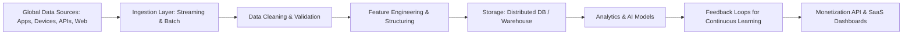

## AI Engineering Products Global Data Capture & Monetization — GitHub README

This is a **production-grade roadmap** for building 1000 AI engineering products that **automatically capture structured, high-value data globally**, ready for resale, SaaS, or embedded enterprise monetization.

---

## Table of Contents

1. [Overview](#overview)
2. [Key Principles](#key-principles)
3. [Architecture](#architecture)
4. [Domains & Products](#domains--products)
5. [Tech Stack](#tech-stack)
6. [Implementation Roadmap](#implementation-roadmap)
7. [Monetization Models](#monetization-models)
8. [Monitoring & Governance](#monitoring--governance)

---

## Overview

This repository outlines **1000 AI engineering products** designed to:

* Capture **automatic, global-scale data**
* Structure, clean, and validate pipelines for **production-grade quality**
* Feed **AI models, dashboards, and analytics**
* Enable **monetization** via API, SaaS, or data resale

The blueprint focuses on **automation, compliance, and scalability** for all domains.

---

## Key Principles

* **Automation First:** Data ingestion → cleaning → feature engineering → storage → analytics → feedback.
* **Data Quality:** Deduplication, normalization, validation, anonymization.
* **Scalability:** Millions of events per day, multi-region deployment.
* **Compliance & Security:** GDPR, HIPAA, financial regulations, encryption.
* **Monetization-Ready:** Structured data sets, SaaS dashboards, API access.

---

## Architecture

---

## Domains & Products

| Domain                         | Product Count | Highlights                                                          |
| ------------------------------ | ------------- | ------------------------------------------------------------------- |
| Financial Data                 | 100           | Transactions, BNPL, SME cashflow, credit scoring, fraud detection   |
| Consumer Behavior & E-Commerce | 100           | Clickstream, purchase behavior, reviews, social sentiment           |
| Operational & Enterprise       | 100           | Fleet, supply chain, energy, employee workflow, IoT sensors         |
| Health & Medical               | 100           | Clinical records, EHR, telemedicine, wearables, public health       |
| Legal & Regulatory             | 100           | Contract clause extraction, case precedents, compliance datasets    |
| AI Interaction & Feedback      | 100           | LLM chats, support AI, feedback loops, personalization              |
| Social & Public                | 100           | Public forums, government data, news, social sentiment              |
| IoT & Sensor                   | 100           | Smart home, industrial sensors, traffic, environmental monitoring   |
| Education & Learning           | 100           | Student engagement, MOOCs, assessments, teacher interactions        |
| Cross-Industry Platforms       | 100           | Multi-domain feature stores, streaming pipelines, anomaly detection |

Total: **1000 production-ready products**

---

## Tech Stack

**Data Ingestion & Pipelines**

* Apache Kafka / RabbitMQ (streaming)
* Airflow / Prefect (orchestration)
* Python + Pandas / Dask / Spark

**Data Cleaning & Validation**

* Great Expectations
* Pandas / Polars / Spark
* NLP preprocessing: SpaCy, NLTK, Hugging Face Transformers

**Storage & Database**

* PostgreSQL / MySQL / Snowflake / BigQuery
* NoSQL: MongoDB, Cassandra
* Vector DB: Pinecone, Milvus

**AI Models & Analytics**

* PyTorch / TensorFlow / JAX
* Hugging Face Transformers (NLP)
* Scikit-learn / XGBoost / LightGBM (classic ML)
* LLM-based analysis for multi-modal data

**Deployment & Monitoring**

* Docker / Kubernetes
* Prometheus / Grafana
* MLflow / Weights & Biases
* Drift detection & alerting

**Security & Compliance**

* Encryption at rest & transit (AES-256, TLS)
* Role-based access (RBAC)
* GDPR & HIPAA-compliant pipelines

---

## Implementation Roadmap

**Phase 1 – Foundation (Q1-Q2)**

* Build ingestion layer, streaming & batch pipelines
* Deploy central storage & feature store
* Implement cleaning, validation, and deduplication pipelines

**Phase 2 – Domain Pipelines (Q2-Q3)**

* Deploy initial products per domain (financial, consumer, operational)
* Test automatic data collection and structured output
* Integrate feedback loops for continuous improvement

**Phase 3 – Scaling & Multi-Region (Q3-Q4)**

* Expand to all 10 domains
* Multi-region deployment for global data capture
* Implement monitoring, anomaly detection, and drift alerts

**Phase 4 – Monetization (Q4 onwards)**

* API endpoints for SaaS and enterprise clients
* Sell datasets or subscriptions on data marketplaces
* Integrate analytics dashboards for premium clients

---

## Monetization Models

1. **SaaS Subscription:** API access or dashboard licenses
2. **Per-Query / Per-Dataset Fee:** High-value structured data resale
3. **Embedded Intelligence Licensing:** Integrate into enterprise workflows
4. **Marketplace Resale:** Structured datasets for analytics firms

---

## Monitoring & Governance

* **Pipeline Health:** Error rates, latency, missing data
* **Data Drift Detection:** Model performance alerts
* **Security:** Encryption, access control, audit logging
* **Compliance:** GDPR, HIPAA, financial regulations
* **Feedback Loops:** Continuous data improvement for models

---

This roadmap transforms an AI engineer’s workflow into a **global-scale, monetizable data infrastructure**, producing **1000 production-ready AI products** that gather high-value data automatically, ensuring **revenue, scale, and defensibility**.

---

I can also create a **visual GitHub-style table mapping all 1000 products by domain, pipeline type, tech stack, and monetization route** for immediate execution planning.

Do you want me to produce that table next?

This is a **production-grade roadmap** for building 1000 AI engineering products that **automatically capture structured, high-value data globally**, ready for resale, SaaS, or embedded enterprise monetization.

---

## Table of Contents

1. [Overview](#overview)
2. [Key Principles](#key-principles)
3. [Architecture](#architecture)
4. [Domains & Products](#domains--products)
5. [Tech Stack](#tech-stack)
6. [Implementation Roadmap](#implementation-roadmap)
7. [Monetization Models](#monetization-models)
8. [Monitoring & Governance](#monitoring--governance)

---

## Overview

This repository outlines **1000 AI engineering products** designed to:

* Capture **automatic, global-scale data**
* Structure, clean, and validate pipelines for **production-grade quality**
* Feed **AI models, dashboards, and analytics**
* Enable **monetization** via API, SaaS, or data resale

The blueprint focuses on **automation, compliance, and scalability** for all domains.

---

## Key Principles

* **Automation First:** Data ingestion → cleaning → feature engineering → storage → analytics → feedback.
* **Data Quality:** Deduplication, normalization, validation, anonymization.
* **Scalability:** Millions of events per day, multi-region deployment.
* **Compliance & Security:** GDPR, HIPAA, financial regulations, encryption.
* **Monetization-Ready:** Structured data sets, SaaS dashboards, API access.

---

## Architecture

---

## Domains & Products

| Domain                         | Product Count | Highlights                                                          |
| ------------------------------ | ------------- | ------------------------------------------------------------------- |
| Financial Data                 | 100           | Transactions, BNPL, SME cashflow, credit scoring, fraud detection   |
| Consumer Behavior & E-Commerce | 100           | Clickstream, purchase behavior, reviews, social sentiment           |
| Operational & Enterprise       | 100           | Fleet, supply chain, energy, employee workflow, IoT sensors         |
| Health & Medical               | 100           | Clinical records, EHR, telemedicine, wearables, public health       |
| Legal & Regulatory             | 100           | Contract clause extraction, case precedents, compliance datasets    |
| AI Interaction & Feedback      | 100           | LLM chats, support AI, feedback loops, personalization              |
| Social & Public                | 100           | Public forums, government data, news, social sentiment              |
| IoT & Sensor                   | 100           | Smart home, industrial sensors, traffic, environmental monitoring   |
| Education & Learning           | 100           | Student engagement, MOOCs, assessments, teacher interactions        |
| Cross-Industry Platforms       | 100           | Multi-domain feature stores, streaming pipelines, anomaly detection |

---

## Tech Stack

**Data Ingestion & Pipelines**

* Apache Kafka / RabbitMQ (streaming)
* Airflow / Prefect (orchestration)
* Python + Pandas / Dask / Spark

**Data Cleaning & Validation**

* Great Expectations
* Pandas / Polars / Spark
* NLP preprocessing: SpaCy, NLTK, Hugging Face Transformers

**Storage & Database**

* PostgreSQL / MySQL / Snowflake / BigQuery
* NoSQL: MongoDB, Cassandra
* Vector DB: Pinecone, Milvus

**AI Models & Analytics**

* PyTorch / TensorFlow / JAX
* Hugging Face Transformers (NLP)
* Scikit-learn / XGBoost / LightGBM (classic ML)
* LLM-based analysis for multi-modal data

**Deployment & Monitoring**

* Docker / Kubernetes
* Prometheus / Grafana
* MLflow / Weights & Biases
* Drift detection & alerting

**Security & Compliance**

* Encryption at rest & transit (AES-256, TLS)
* Role-based access (RBAC)
* GDPR & HIPAA-compliant pipelines

---

## Implementation Roadmap

**Phase 1 – Foundation (Q1-Q2)**

* Build ingestion layer, streaming & batch pipelines
* Deploy central storage & feature store
* Implement cleaning, validation, and deduplication pipelines

**Phase 2 – Domain Pipelines (Q2-Q3)**

* Deploy initial products per domain (financial, consumer, operational)
* Test automatic data collection and structured output
* Integrate feedback loops for continuous improvement

**Phase 3 – Scaling & Multi-Region (Q3-Q4)**

* Expand to all 10 domains
* Multi-region deployment for global data capture
* Implement monitoring, anomaly detection, and drift alerts

**Phase 4 – Monetization (Q4 onwards)**

* API endpoints for SaaS and enterprise clients
* Sell datasets or subscriptions on data marketplaces
* Integrate analytics dashboards for premium clients

---

## Monetization Models

1. **SaaS Subscription:** API access or dashboard licenses
2. **Per-Query / Per-Dataset Fee:** High-value structured data resale
3. **Embedded Intelligence Licensing:** Integrate into enterprise workflows
4. **Marketplace Resale:** Structured datasets for analytics firms

---

## Monitoring & Governance

* **Pipeline Health:** Error rates, latency, missing data
* **Data Drift Detection:** Model performance alerts
* **Security:** Encryption, access control, audit logging
* **Compliance:** GDPR, HIPAA, financial regulations
* **Feedback Loops:** Continuous data improvement for models

---
